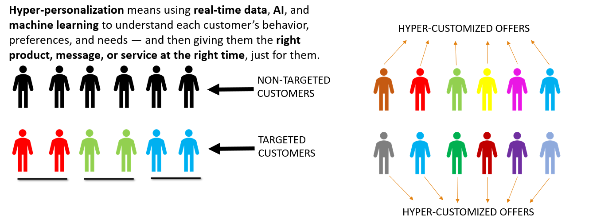
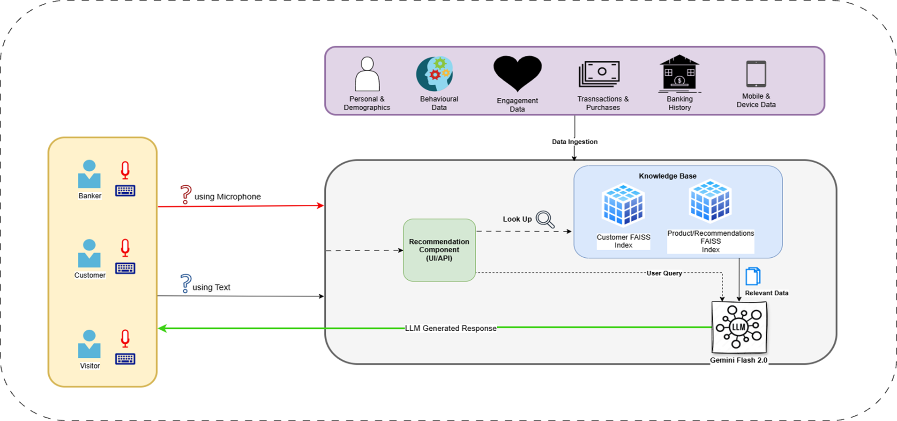
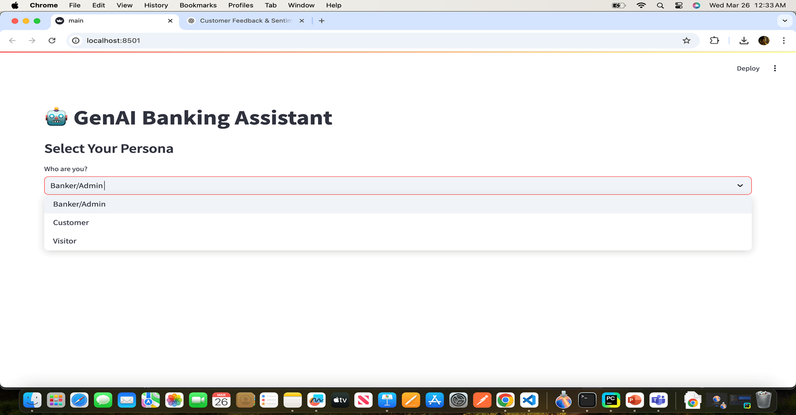
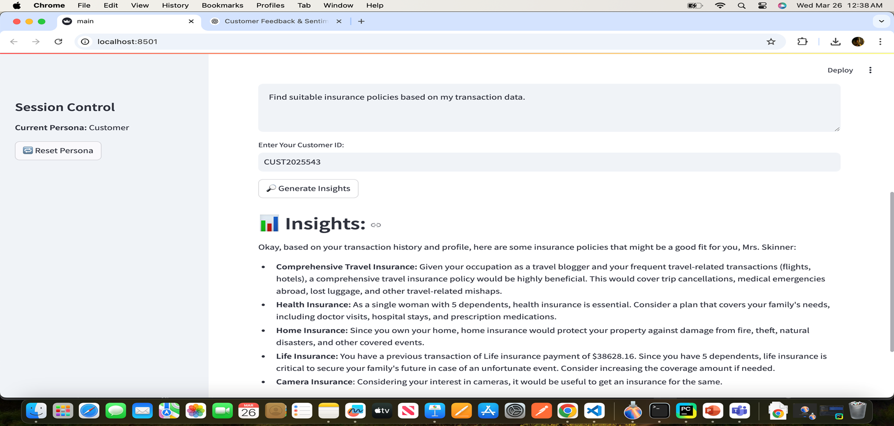

# 🚀 Hyper Personalization - using Gen AI.

## 📌 Table of Contents

- [Introduction](#introduction)
- [Demo](#demo)
- [Inspiration](#inspiration)
- [What It Does](#what-it-does)
- [How We Built It](#how-we-built-it)
- [Challenges We Faced](#challenges-we-faced)
- [How to Run](#how-to-run)
- [Tech Stack](#tech-stack)
- [Team](#team)

---

## 🎯 Introduction

We are building an application that leverages the **Gen AI tech stack**, implementing **RAG (Retrieval-Augmented Generation)** over **LLM (Gemini Flash 2.0)** to address key challenges in the banking industry. The goal is to **boost customer engagement and retention** by delivering **Hyper-Personalized experiences.**

Our system allows users to **interact using both text (keyboard)** and **voice (audio)** input, making the experience natural, seamless, and inclusive.



## Architecture

Refer artifacts/arch folder, "Hyper.drawio" file for the architecture diagram.


## 🎥 Demo

🔗 (#) PPT - Refer artifacts/demo for **Hyperpersonalization_BlackPanthers.pptx**

📹 (#) Video -

- **Normal quality video** - Refer artifacts/demo/Demo_Video.mp4
- **HD Video - Google Drive** - https://drive.google.com/file/d/1LF3SKFd_vfEgyRLZfWsIieUU0icoqxkX/view?usp=drive_link

🖼️ **Screenshots:**

**_Choose Personas:_**


**_Pre-Populated suggested categories and related Prompts_**


**_Personalized Insights based on customer behavior pattern /sentiment analysis_**



## 💡 Inspiration

In modern banking, personalization is expected — but most systems still rely on rule-based segments. This leads to:

- Missed engagement opportunities.

- Poor product relevance.

- High churn, especially among digital-native customers.

We were inspired to build a system that understands each customer’s **context, sentiment, preferences, and behavior**, and interacts through **natural language — typed or spoken** — powered by GenAI.

## ⚙️ What It Does

This GenAI-powered banking assistant:

- Provides personalized product and service recommendations.

- Supports **three personas**: Admin, Bank Customer, Visitor

- Accepts **user input via keyboard or audio (speech-to-text)**

- Analyzes **customer sentiment and feedback trends.**

- Generates insights on **spending behavior and engagement**.

- Detects **risk signals** and supports **fraud detection**.

- Uses **RAG with Gemini Flash 2.0 + FAISS** for fast and contextual responses.

- Offers a clean UI with **Streamlit** for interaction and visualization.

## 🛠️ How We Built It

- **Loaded customer profile, feedback, sentiment, and transaction data** from multi-sheet Excel.

- Created unified **customer-level JSON** records.

- Generated **embeddings** using **_bge-small-en_** model for both customers and product/offer sheets.

- Indexed embeddings into **FAISS vector DBs**

- Built a **modular RAG pipeline** connected to Gemini Flash 2.0 (Google Generative AI)

- Designed a **Streamlit UI** with:

  - Persona-based interaction flow

  - **Suggested prompt buttons**

  - **Audio or typed input box**

  - Output section showing rich responses

## 🚧 Challenges We Faced

- Structuring diverse tabular banking data into rich, LLM-ready JSON

- Ensuring **prompt consistency and LLM grounding**

- Synthesizing **500+ unique customer feedback examples**

- Making **voice input** smooth across browsers

- Keeping the **UI intuitive** while supporting power users like Admins

- Aligning embeddings for mixed data types (products, sentiment, history)

- Reducing response time while querying large FAISS indexes

## 🏃 How to Run

1. Clone the repository

   ```sh
   git clone https://github.com/ewfx/aidhp-black-panthers.git
   ```

2. Install Python 3.12.9 and make sure pip is available.

3. There are two modules in the project.

   - **genai_faiss_pipeline_bankingHist.ipynb** - To convert customer data into json and generate embeddings.
   - **main_final.py** - Streamlit app which accpets user inputs, converts to embeddings and invokes RAG(LLM) for output.
     **_Make sure to refer the embeddings generated in the previous step._**

   - Raw data is available in code/src/data.

4. Install dependencies
   ```sh
   pip install -r requirements.txt
   ```
5. Make sure to update the GEMINI API Key in .env file.

6. Run the project
   ```sh
   python -m streamlit run main_final.py
   ```

## 🏗️ Tech Stack

- 🔹 Python, Streamlit, FAISS, Pandas, SentenceTransformers
- 🔹 Gemini Flash 2.0 (via Google Generative AI API)
- 🔹 Whisper/Browser Speech-to-Text for voice input
- 🔹 dotenv, openpyxl, json, faker

## Voice + Text Input Demo

- Speak your query:
  - What kind of investment plans suit me based on my income and past transactions?”
- Or type your question:
  - “Should I buy a Term Plan?”

## 👥 Team

- **Basha Sheik** - [GitHub](#) | [LinkedIn](#)
- **Srikanth Belide** - [GitHub](#) | [LinkedIn](#)
- **Manju Sri Male** - [GitHub](#) | [LinkedIn](#)
- **Saravana Prabu Govindaraj** - [GitHub](#) | [LinkedIn](#)
